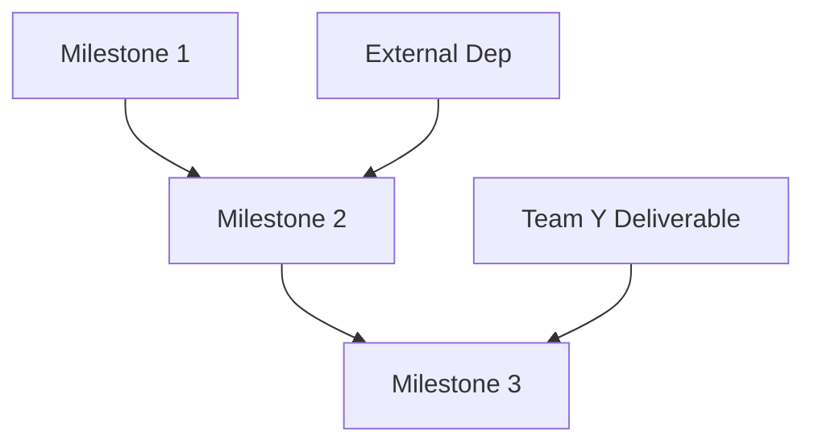

# [Project/Package Name] Roadmap

> Strategic planning document for long-term direction. Use this template for multi-quarter/multi-version planning.

## Vision

Where are we heading? One or two sentences describing the long-term goal.

> _Example: "Become the universal bridge for AI agent configuration across all major IDEs and TUIs."_

## Current State

- **Version**: X.Y.Z
- **Last Release**: YYYY-MM-DD
- **Last Updated**: YYYY-MM-DD
- **Stability**: [Stable | Beta | Alpha | Experimental]

### Recent Accomplishments
- ✅ [Major milestone 1]
- ✅ [Major milestone 2]

### Current Focus
- 🚧 [Active initiative 1]
- 🚧 [Active initiative 2]

---

## Strategic Themes

What are the key themes driving this roadmap?

| Theme | Description | Priority |
|-------|-------------|----------|
| [Theme 1] | [Why this matters] | High |
| [Theme 2] | [Why this matters] | Medium |

---

## Timeline

### Q1 202X — Theme: [Theme Name]

**Objective**: [What we're trying to achieve this quarter]

| Milestone | Status | Target | Dependencies | Notes |
|-----------|--------|--------|--------------|-------|
| [M1: Name] | ✅ Done | YYYY-MM | None | Summary |
| [M2: Name] | 🚧 In Progress | YYYY-MM | M1 | Summary |
| [M3: Name] | 📋 Planned | YYYY-MM | M2 | Summary |
| [M4: Name] | 💡 Under Review | TBD | M3 | Summary |

**Key Deliverables**:
- [ ] [Deliverable 1]
- [ ] [Deliverable 2]

**Risks**:
- [Risk 1]: [Mitigation]

---

### Q2 202X — Theme: [Theme Name]

**Objective**: [What we're trying to achieve this quarter]

| Milestone | Status | Target | Dependencies | Notes |
|-----------|--------|--------|--------------|-------|
| [M1: Name] | 📋 Planned | YYYY-MM | [Prev Q milestone] | Summary |
| [M2: Name] | 📋 Planned | YYYY-MM | M1 | Summary |

**Key Deliverables**:
- [ ] [Deliverable 1]

---

### Q3-Q4 202X — Theme: [Theme Name]

_Broad planning for later quarters - details to be filled as we approach_

| Initiative | Status | Quarter | Notes |
|------------|--------|---------|-------|
| [Initiative 1] | 🔮 Future | Q3 | Summary |
| [Initiative 2] | 🔮 Future | Q4 | Summary |

---

## Backlog (Unscheduled)

Items that are important but not yet scheduled:

| Item | Priority | Effort | Why It Matters |
|------|----------|--------|----------------|
| [Item 1] | High | L | [Context] |
| [Item 2] | Medium | M | [Context] |
| [Item 3] | Low | S | [Context] |

---

## Dependencies Map

External and internal dependencies affecting the roadmap:

---

## Key Decisions Shaping This Roadmap

| ADR | Decision | Impact |
|-----|----------|--------|
| ADR-001 | [Title] | [How it affects the roadmap] |
| ADR-002 | [Title] | [How it affects the roadmap] |

---

## Success Metrics

How will we measure progress against this roadmap?

| Metric | Current | Q1 Target | Q2 Target | Q4 Target |
|--------|---------|-----------|-----------|-----------|
| [Metric 1] | [Value] | [Target] | [Target] | [Target] |
| [Metric 2] | [Value] | [Target] | [Target] | [Target] |

---

## Assumptions & Risks

### Assumptions
- [Assumption 1: e.g., "Team size remains stable"]
- [Assumption 2: e.g., "Technology X reaches v1.0"]

### Risks
| Risk | Probability | Impact | Contingency |
|------|-------------|--------|-------------|
| [Risk 1] | High/Med/Low | High/Med/Low | [Plan B] |

---

## Changelog

| Date | Change | Author |
|------|--------|--------|
| YYYY-MM-DD | [Description of change] | [Name] |
| YYYY-MM-DD | Initial roadmap created | [Name] |

---

## Legend

| Symbol | Meaning |
|--------|---------|
| ✅ | Complete |
| 🚧 | In Progress |
| 📋 | Planned (committed) |
| 💡 | Under Review / Proposed |
| 🔮 | Future (not yet planned) |
| ❌ | Cancelled / Deprioritized |

---

**Owner**: [Name/Team]
**Last Updated**: YYYY-MM-DD
**Next Review**: YYYY-MM-DD
