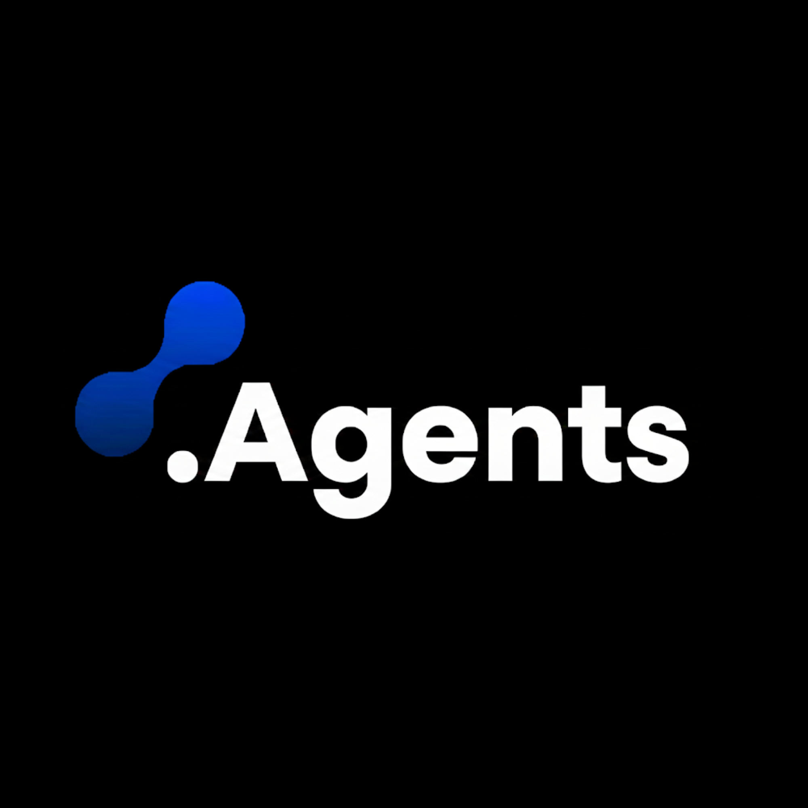
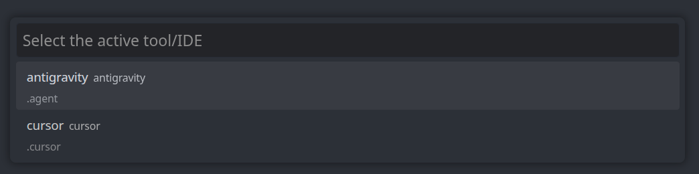
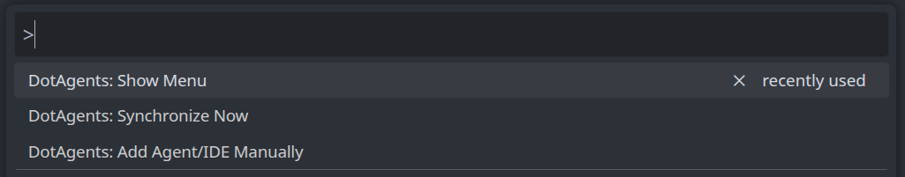
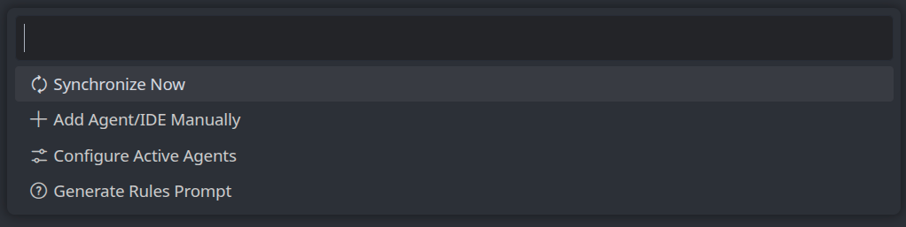
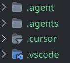

#  DotAgents VSCode Extension

DotAgents is a powerful synchronization tool designed to bridge AI configurations, rules, and context across different IDEs, AI extensions, and terminal-based tools (such as Cursor, Cline, AntiGravity, OpenCode, and VSCode).

By establishing a universal `.agents/` bridge directory in your workspace, DotAgents ensures that your AI assistants share the exact same context regardless of the editor you switch to.

---

## Features

- **Automatic IDE Detection**: Detects your active AI editor/tool on startup and automatically provisions the required workspace synchronization structure (`.agents/.ai/`).
- **Real-time Bidirectional Sync**: Watches for file modifications. Changes in your specific IDE folder (e.g., `.cursor/rules`) automatically synchronize to the universal `.agents/` bridge, and vice-versa.
- **Cross-Tool Context Sharing**: Easily switch from Cursor to VSCode (using Cline) without losing your AI rules structure. DotAgents prompts you when it detects a tool change to seamlessly manage synchronization paths.
- **Remote & Local Rules Engine**: Fetches and installs standard configuration capabilities automatically, and supports your own custom YAML rules seamlessly.

## Getting Started

1. **Install the Extension** from the VSCode Marketplace (or build from source).
2. **Open a Workspace**: As soon as you open a project, DotAgents detects your host IDE.
3. **Automatic Provisioning**: If you don't have a `.agents/.ai/` structure in your workspace, DotAgents will automatically create it.
4. **Tool Selection**: By default, it detects your current IDE based on the environment footprint. If it's a new or unrecognized tool, it will prompt you specifying that the IDE is not recognized and give you options to either configure it manually or create a new agent rule.

   
5. **Start Coding**: Any AI tool settings, rules or configurations you modify will now be synchronized seamlessly.

## Extension Commands

You can access DotAgents workflows through the Command Palette (`Ctrl+Shift+P` / `Cmd+Shift+P`):

- **`DotAgents: Show Menu`**: Opens the main configuration menu where you can configure the active agent, view options, and interact with the bridge.

  

- **`DotAgents: Synchronize Now`**: Manually forcefully triggers a synchronization execution. It will prompt you to explicitly pick a direction (Host IDE ➔ `.agents` bridge, or `.agents` bridge ➔ Host IDE).
- **`DotAgents: Add Agent/IDE Manually`**: Lets you add a tool manually, either from the dynamically discovered known list or providing custom definitions for an unsupported agent.

## Configuration

You can tweak the extension behavior in your VSCode `settings.json`:

- `dotagents.debug.logToFile`: Enable writing debug output to a file (default: `true`).
- `dotagents.debug.logFilePath`: Path relative to the workspace root for the debug log (default: `../dotagents/.agents/.ai/extension-debug.log`).

## How It Works

DotAgents utilizes an embedded rules engine using **YAML format** configurations stored in `.agents/.ai/rules/{agentId}.yaml`.

These rules map inbound and outbound file paths to perform reactive, incremental synchronizations efficiently. The Extension uses FileSystem Watchers to guarantee high-performance updates that only touch the affected files when modifications occur on either side (IDE specific folders vs Universal `.agents/` folder).

---

## Custom Rules (Adding Non-Standard Agents)

DotAgents dynamically merges known agents with your custom definitions. If your favorite AI app is not natively supported yet, you can easily integrate it by creating your own rule:

1. Create a new YAML file inside your workspace at `.agents/.ai/rules/`. For example, `.agents/.ai/rules/my-custom-agent.yaml`.
2. Define the agent settings including its `id`, `name`, `paths`, and `mappings` following the standard DotAgents rule format.
3. Open the Command Palette and run `DotAgents: Add Agent/IDE Manually`.
4. Your new agent will appear in the list under the dynamically discovered rules. Select it, and DotAgents will immediately synchronize according to your defined mappings.
