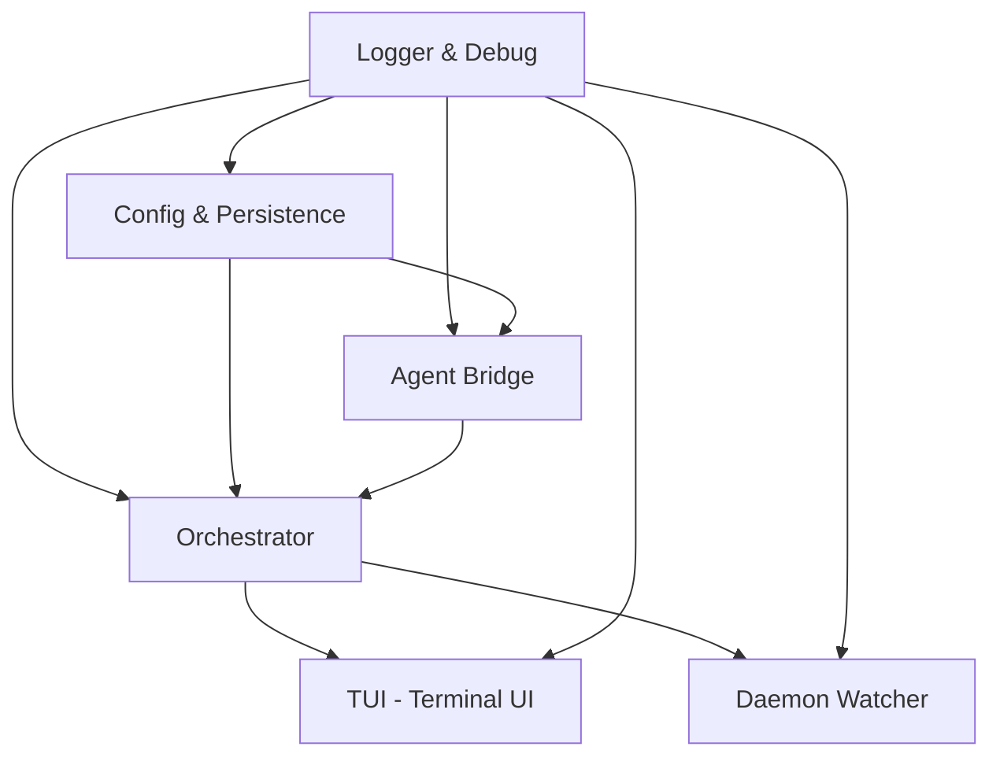

# CLI Architecture: Modular Structure for Parity

To achieve parity with the VSCode extension while following **Slice Architecture** and **Hexagonal Principles**, the CLI must be organized into the following modules and infrastructure adapters.

## 1. Orchestrator Module
This is the core module that coordinates synchronization and management tasks.

- **Application (Use Cases)**:
  - Reuses shared use cases: `StartSyncOrchestration`, `FetchAndInstallRules`, `MigrateAgents`, `GetMissingRules`.
- **Infrastructure (Adapters)**:
  - `NodeConfigRepository`: Manages project configuration.
  - `DiffSyncAdapter`: Handles the delta-sync logic.
  - `CliLogger`: Terminal-specific logger with color-coded levels.
  - `DaemonService`: Manages the background process lifecycle.

## 2. Watcher Module (Daemon Mode)
Handles real-time file system monitoring to enable reactive synchronization.

- **Infrastructure (Adapters)**:
  - `CliIdeWatcher`: Monitors external IDE/Agent paths for changes.
  - `CliAgentsWatcher`: Monitors the project's `.agents/` directory.
  - `IgnoredPathsRegistry`: Filters out system and temporary files.

## 3. UI Module (Interactive Terminal)
Provides the interactive layer for user control, mirroring the VSCode Command Palette.

- **Infrastructure (Adapters)**:
  - `InteractiveMenu`: A CLI-based menu (built with `enquirer` or similar) for:
    - `Synchronize Now`
    - `Add Agent Manually`
    - `Configure Active Agent`
    - `Generate Rules Prompt`
  - `CliTerminalFeedback`: Spinners and progress indicators for long-running synchronization tasks.

## 4. Agent Bridge Module
Specific logic for linking the project with external agent environments.

- **Application**:
  - `AddAgentManuallyUseCase`.
- **Infrastructure**:
  - `CliAgentScanner`: Detects agent paths within the file system.
  - `CliAgentHostDetector`: Automatically detects the surrounding environment (Terminal, IDE integrated terminal, etc.).

## 5. Shared Layers
Common functionality used across all modules.

- **Domain**: Entities (`Agent`,
## Implementation Roadmap & Dependencies

To ensure a stable build, the modules must be implemented following a dependency-first approach.

### Dependency Graph

### Module Build Order

| Order | Module | Dependency | Rationale | Status |
| :--- | :--- | :--- | :--- | :--- |
| **1** | **Logger & Debug** | None | Base for visibility and debugging daemon processes. | ✅ Complete |
| **2** | **Config & Persistence** | Logger | Required to load project manifests and CLI-specific preferences. | 🔵 Pending |
| **3** | **Agent Bridge** | Logger, Config | Mandatory for environment detection and agent scanning. | 🔵 Pending |
| **4** | **Orchestrator** | Logger, Config, Bridge | Central hub coordinating shared Use Cases. | 🔵 Pending |
| **5** | **TUI Module** | Orchestrator, Logger | Interactive layer to trigger orchestration actions. | 🔵 Pending |
| **6** | **Daemon Watcher** | Orchestrator, Logger | Background service for automated reactive synchronization. | 🔵 Pending |

## Summary Module Checklist

- [ ] **Orchestrator Module**: Core sync logic and use case orchestration.
- [ ] **Daemon Watcher Module**: Background filesystem monitoring (Reactive Sync).
- [ ] **TUI (Terminal User Interface) Module**: Interactive menus, prompts, and status feedback.
- [ ] **Agent Bridge Module**: Implementation of scanners and host detectors for the terminal environment.
- [ ] **Config & Persistence Module**: Managing `.agents` project state and CLI-specific preferences.
- [x] **Logger & Debug Module**: Specialized terminal output with file-based persistence for background logs.
