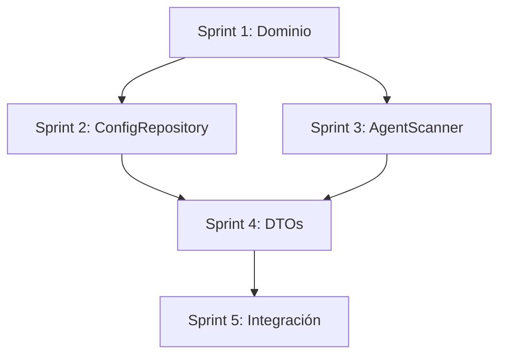

# Estado General del Plan de Corrección (#21526)

## Resumen Ejecutivo
Plan de corrección para los errores conceptuales en la estructura de sincronización y configuración del sistema `.agents`. Se identificaron tres áreas críticas que requieren refactorización en las capas de Dominio e Infraestructura.

---

## Tabla de Estado de Sprints

| Index | Name | Descripción | Status |
|-------|------|-------------|--------|
| 1 | Refactorización de Dominio | Corregir la entidad `SyncManifest` y sus métodos de inicialización | 🟢 Completo |
| 2 | Corrección de Infraestructura - ConfigRepository | Eliminar la subcarpeta `.ai` y guardar directamente en `.agents/` | 🟢 Completo |
| 3 | Refactorización de AgentScanner | Reemplazar el escaneo de directorios por detección de agentes IDE reales | 🟢 Completo |
| 4 | Actualización de DTOs y Contratos | Sincronizar interfaces y DTOs con los cambios de dominio | 🟢 Completo |
| 5 | Pruebas de Integración | Validar el flujo completo de inicialización y sincronización | 🔵 Por hacer |

---

## Dependencias Globales

---

## Métricas del Plan

- **Total de Sprints**: 5
- **Archivos a Modificar**: ~6 archivos
- **Complejidad Estimada**: Media-Alta
- **Paquetes Afectados**: `@dotagents/diff`, `apps/vscode`

---

## Archivos Afectados

### `packages/diff/src/modules/config/`
- `domain/entities/SyncManifest.ts`
- `app/use-cases/InitializeProjectUseCase.ts`
- `domain/ports/IConfigRepository.ts`
- `domain/ports/IAgentScanner.ts`

### `apps/vscode/src/modules/orchestrator/`
- `infra/NodeConfigRepository.ts`
- `infra/FsAgentScanner.ts`

---

## Referencias
- **Informe de Errores**: `info.md`
- **Estándares de Arquitectura**: `/.agent/rules/arquitecture.md`
- **Estándares de Código**: `/.agent/rules/code.md`
